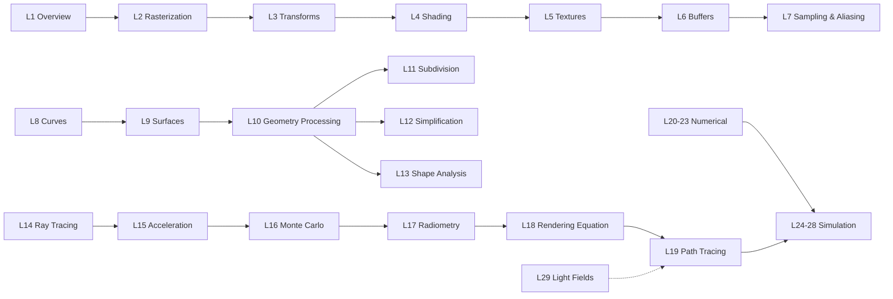

> Compiled from the full CMU 15-462/662 *Computer Graphics* course (taught by Keenan Crane), at lecture-note granularity — every algorithm and formula per lecture. Conventions: vectors bold, matrices uppercase; $\theta$ = angle, $\omega$ = solid-angle direction. Use alongside the slides: grasp the algorithm flow, memorize the derivations, then implement.

## Course Map

One route: **Rasterization (how to draw) → Geometry (what to draw) → Ray Tracing (how light works) → Numerical Methods (how to compute accurately) → Simulation (how things move)**. Numbers are official lecture IDs.

---

## 1. Rasterization (L1–L2, L6)

**Problem**: given a triangle, determine which pixels it covers and shade them.

### 1.1 Imaging Model

Pinhole camera: light passes through a tiny hole onto the sensor. Pipeline: vertices → transform to clip/NDC space → rasterize → shade fragments → framebuffer.

### 1.2 Screen Coordinates & Pixel Convention

- Pixel centers at $(x + 0.5, y + 0.5)$ (half-integer offset)
- Viewport transform (NDC $[-1,1]^2$ → screen $[0,W]\times[0,H]$):

$$x_{screen} = \frac{(x_{ndc} + 1)}{2} \cdot W, \qquad y_{screen} = \frac{(y_{ndc} + 1)}{2} \cdot H$$

### 1.3 Barycentric Coordinates

$$p = \alpha a + \beta b + \gamma c, \qquad \alpha + \beta + \gamma = 1$$

- Inside iff $\alpha, \beta, \gamma \ge 0$
- Area interpretation: $\alpha = \dfrac{A_{pbc}}{A_{abc}}$
- Closed form (cross products):

$$\alpha = \frac{(c - b) \times (p - b)}{(c - b) \times (a - b)}, \qquad
\beta = \frac{(a - c) \times (p - c)}{(a - c) \times (b - c)}, \qquad
\gamma = 1 - \alpha - \beta$$

- Used to interpolate colors, normals, UVs, depth (after perspective correction)

### 1.4 Edge Function

For directed edge $(a \to b)$:

$$E_{ab}(p) = (b_x - a_x)(p_y - a_y) - (b_y - a_y)(p_x - a_x)$$

- $E > 0$: $p$ left of the edge; inside = same sign on all three edges
- Relationship to barycentrics: normalized edge functions *are* the barycentric coordinates
- **Incremental**: $E_{ab}(p + (1,0)) = E_{ab}(p) + (b_y - a_y)$ — one add per pixel; the basis of GPU rasterization

### 1.5 Coverage & Traversal

- **Per-pixel test**: iterate the bounding box $[x_{\min},x_{\max}]\times[y_{\min},y_{\max}]$, evaluate three edge functions
- **Scanline**: per row compute edge crossings $(x_l, x_r)$, fill the span
- Output: fragments (pixel position + interpolated attributes)

### 1.6 Perspective-Correct Interpolation (key derivation)

Screen-space depth $z$ is *not* linear under perspective. Correct approach: interpolate $\frac{1}{z}$ linearly, then invert:

$$z(p) = \frac{1}{\frac{\alpha}{z_a} + \frac{\beta}{z_b} + \frac{\gamma}{z_c}}$$

For any attribute $f$ (color/UV/normal):

$$f(p) = \frac{\frac{\alpha f_a}{z_a} + \frac{\beta f_b}{z_b} + \frac{\gamma f_c}{z_c}}{\frac{\alpha}{z_a} + \frac{\beta}{z_b} + \frac{\gamma}{z_c}}$$

I.e. **divide by $z$, interpolate, multiply back** (GPUs do this with $w$).

### 1.7 Z-Buffer

$$\text{if } z_{new} < z_{buf}[x][y]: \quad \text{write color, update depth}$$

- Order-independent; $O(1)$ per pixel
- Precision: use **reverse-Z** ($\frac{1}{z}$) or logarithmic depth for near-field precision
- vs painter's algorithm: $O(n\log n)$ sort and fails on cyclic overlap

### 1.8 Sampling & Aliasing (L7)

- Aliasing = sampling below signal frequency. Nyquist: $f_s > 2 f_{\max}$
- Sampling = signal × impulse comb; frequency domain = replicated spectrum
- Reconstruction = convolution with sinc (low-pass); practical filters (box/linear/Gaussian) trade blur vs ringing
- Artifacts: jaggies (geometry), moiré (textures), wagon-wheel (temporal)
- Anti-aliasing:
  - **MSAA**: 2/4/8 subsamples per pixel for coverage only, one fragment shade (much cheaper than SSAA)
  - **SSAA**: render at high resolution, downsample
  - **Jittering**: add random offsets — aliasing becomes noise
  - **Mipmap/anisotropic filtering**: prefiltering in texture domain

### 1.9 Classical Algorithms

- **Bresenham line**: integer only; error term $e \leftarrow e + \Delta y$, step diagonally when $e > \Delta x$
- **Scanline polygon fill**: intersect rows, parity rule, pair and fill
- **DDA**: floating-point incremental stepping

---

## 2. Transforms (L3)

**Problem**: model → world → view → clip/NDC → screen.

### 2.1 Homogeneous Coordinates

$$p = \begin{pmatrix} x \\ y \\ z \\ 1 \end{pmatrix}, \qquad (x, y, z, w) \equiv \left(\frac{x}{w}, \frac{y}{w}, \frac{z}{w}\right)$$

- Translation becomes linear; perspective becomes linear; composition = matrix multiply
- Affine: $M = \begin{bmatrix} A & t \\ 0^T & 1 \end{bmatrix}$

### 2.2 2D Transforms

Rotation $\theta$, scale $(s_x, s_y)$, shear:

$$R = \begin{bmatrix} \cos\theta & -\sin\theta \\ \sin\theta & \cos\theta \end{bmatrix}, \quad
S = \begin{bmatrix} s_x & 0 \\ 0 & s_y \end{bmatrix}, \quad
H_x = \begin{bmatrix} 1 & a \\ 0 & 1 \end{bmatrix}$$

Rotation about arbitrary point $p$ = translate $-p$ → rotate → translate $p$.

### 2.3 3D Rotation Matrices

$$R_x = \begin{bmatrix} 1 & 0 & 0 \\ 0 & \cos\theta & -\sin\theta \\ 0 & \sin\theta & \cos\theta \end{bmatrix}, \quad
R_y = \begin{bmatrix} \cos\theta & 0 & \sin\theta \\ 0 & 1 & 0 \\ -\sin\theta & 0 & \cos\theta \end{bmatrix}, \quad
R_z = \begin{bmatrix} \cos\theta & -\sin\theta & 0 \\ \sin\theta & \cos\theta & 0 \\ 0 & 0 & 1 \end{bmatrix}$$

**Rodrigues' formula** (unit axis $k$):

$$R = I\cos\theta + [k]_\times \sin\theta + kk^T(1-\cos\theta), \qquad v' = v\cos\theta + (k\times v)\sin\theta + k(k\cdot v)(1-\cos\theta)$$

### 2.4 Transform Hierarchy

| Transform | DOF | Preserves |
|---|---|---|
| Rigid (translation/rotation) | 3/3 | distances, angles |
| Isometry | 6 | distances, angles |
| Similarity (incl. scale) | 7 | angles, ratios |
| Affine | 12 | parallelism |
| Projective (incl. perspective) | 15 | collinearity, cross-ratio |

Composition reads right-to-left: $M = T \cdot R \cdot S$.

### 2.5 View Matrix (LookAt)

Camera $e$, target $c$, up $u$:

$$g = \frac{c - e}{\|c - e\|}, \quad w = \frac{g \times u}{\|g \times u\|}, \quad t = w \times g$$

$$V = \begin{bmatrix} w_x & w_y & w_z & -w\cdot e \\ t_x & t_y & t_z & -t\cdot e \\ -g_x & -g_y & -g_z & g\cdot e \\ 0 & 0 & 0 & 1 \end{bmatrix}$$

### 2.6 Projection Matrices (derivation)

**Orthographic**: translate center to origin, scale.

**Perspective**: squeeze the frustum into a box, then orthographic. Core relation (similar triangles):

$$x' = \frac{n}{-z} x, \qquad y' = \frac{n}{-z} y$$

Let $w' = -z$, then divide by $w$:

$$M_{persp} = \begin{bmatrix} n & 0 & 0 & 0 \\ 0 & n & 0 & 0 \\ 0 & 0 & n+f & -fn \\ 0 & 0 & 1 & 0 \end{bmatrix}
\quad \text{(symmetric frustum, after } w \text{ division)}$$

OpenGL full version (asymmetric frustum $l,r,b,t$, depth to $[-1,1]$):

$$M_{persp} = \begin{bmatrix} \frac{2n}{r-l} & 0 & \frac{r+l}{r-l} & 0 \\ 0 & \frac{2n}{t-b} & \frac{t+b}{t-b} & 0 \\ 0 & 0 & -\frac{f+n}{f-n} & -\frac{2fn}{f-n} \\ 0 & 0 & -1 & 0 \end{bmatrix}$$

**Perspective divide happens at rasterization with per-vertex $w$ interpolation** (see §1.6). Focal length vs FOV: $f = \frac{H/2}{\tan(\alpha/2)}$.

### 2.7 Quaternions

- Unit quaternion $q = (\cos\frac{\theta}{2}, \sin\frac{\theta}{2}\hat{u})$ rotates by $\theta$ about $\hat{u}$
- Rotation: $v' = q\,v\,q^{-1}$; composition: $q_{total} = q_2 q_1$; inverse: $q^{-1} = \frac{\bar q}{\|q\|^2}$
- Matrix form: $R = I + 2s[v]_\times + 2[v]_\times^2$ ($v$ imaginary part, $s$ scalar part)
- **Slerp** (shortest arc on the unit sphere):

$$\text{slerp}(q_1, q_2, t) = \frac{\sin((1-t)\Omega)\,q_1 + \sin(t\Omega)\,q_2}{\sin\Omega}, \qquad \Omega = \arccos(q_1 \cdot q_2)$$

- Why: no gimbal lock, compact, natural interpolation

---

## 3. Curves & Surfaces (L8–L9)

**Problem**: control points → smooth curves/surfaces; evaluate, differentiate, subdivide.

### 3.1 Bezier Curves

**Bernstein basis** (degree $n$):

$$B_i^n(t) = \binom{n}{i} t^i (1-t)^{n-i}, \qquad \sum_i B_i^n(t) = 1, \quad B_i^n(t) \ge 0 \ (t \in [0,1])$$

Curve: $B(t) = \sum_{i=0}^{n} B_i^n(t) P_i$

**de Casteljau** (recursive linear interpolation, $O(n^2)$):

$$P_i^{(k)} = (1-t) P_i^{(k-1)} + t P_{i+1}^{(k-1)}, \qquad P_i^{(0)} = P_i, \quad B(t) = P_0^{(n)}$$

**Properties**:
- Endpoints: $B(0) = P_0, B(1) = P_n$; endpoint tangents: $B'(0) = n(P_1 - P_0)$
- Convex hull; variation diminishing (wiggles ≤ control polygon)
- Affine invariance

**Derivative (hodograph)**: $B'(t) = n \sum_{i=0}^{n-1} B_i^{n-1}(t)\,(P_{i+1} - P_i)$

**Matrix form** (cubic): $B(t) = \begin{bmatrix} 1 & t & t^2 & t^3 \end{bmatrix} \begin{bmatrix} 1 & 0 & 0 & 0 \\ -3 & 3 & 0 & 0 \\ 3 & -6 & 3 & 0 \\ -1 & 3 & -3 & 1 \end{bmatrix} \begin{bmatrix} P_0 \\ P_1 \\ P_2 \\ P_3 \end{bmatrix}$

**Degree elevation**: new control points $Q_i = \frac{i}{n+1}P_{i-1} + (1 - \frac{i}{n+1})P_i$

**Subdivision (corner cutting)**: at $t = \frac12$, the two sub-curves' control points come from the de Casteljau triangle boundary.

### 3.2 B-spline & NURBS

**Cox–de Boor recurrence** (order $k$, knot vector $[t_0, t_1, \dots]$):

$$N_i^1(t) = \begin{cases} 1 & t_i \le t < t_{i+1} \\ 0 & \text{otherwise} \end{cases}$$

$$N_i^k(t) = \frac{t - t_i}{t_{i+k-1} - t_i} N_i^{k-1}(t) + \frac{t_{i+k} - t}{t_{i+k} - t_{i+1}} N_{i+1}^{k-1}(t)$$

- Local support; **NURBS**: $B(t) = \frac{\sum N_i^k(t) w_i P_i}{\sum N_i^k(t) w_i}$ (weights → exact circles/conics)

**Continuity**: $C^0$ position, $C^1$ tangent, $C^2$ curvature. Bezier join at $C^1$ iff $P_2, P_3(=Q_0), Q_1$ collinear with constant ratio $\frac{|P_3 - P_2|}{|Q_1 - Q_0|}$.

### 3.3 Catmull-Rom (interpolating)

Given $P_{i-1}, P_i, P_{i+1}, P_{i+2}$:

$$B(t) = \frac{1}{2} \begin{bmatrix} 1 & t & t^2 & t^3 \end{bmatrix} \begin{bmatrix} 0 & 2 & 0 & 0 \\ -1 & 0 & 1 & 0 \\ 2 & -5 & 4 & -1 \\ -1 & 3 & -3 & 1 \end{bmatrix} \begin{bmatrix} P_{i-1} \\ P_i \\ P_{i+1} \\ P_{i+2} \end{bmatrix}$$

Passes through $P_i, P_{i+1}$; tangent $B'(0) = \frac{P_{i+1} - P_{i-1}}{2}$.

### 3.4 Bezier Surfaces (tensor product)

$$S(u, v) = \sum_{i=0}^{n} \sum_{j=0}^{m} B_i^n(u)\, B_j^m(v)\, P_{ij}$$

- Evaluate: Bezier along $u$ per row, then along $v$
- Partial: $\frac{\partial S}{\partial u} = \sum_{ij} \dot{B}_i^n(u) B_j^m(v) P_{ij}$
- Normal: $n = \frac{\partial S}{\partial u} \times \frac{\partial S}{\partial v}$ (normalize)
- Surfaces of revolution; swept surfaces

### 3.5 Subdivision Surfaces (L11)

**Chaikin** (1D): $q_{2i} = \frac{3}{4}P_i + \frac{1}{4}P_{i+1}$, $q_{2i+1} = \frac{1}{4}P_i + \frac{3}{4}P_{i+1}$ → quadratic B-spline

**Loop** (triangle meshes):
- Edge point: $E = \frac{3}{8}(v_1 + v_2) + \frac{1}{8}(v_3 + v_4)$
- Vertex (valence $n$): $v' = (1 - n\beta)v + \beta \sum_{j} v_j$, $\beta = \dfrac{1}{n}\left[\dfrac{5}{8} - \left(\dfrac{3}{8} + \dfrac{1}{4}\cos\dfrac{2\pi}{n}\right)^2\right]$
- Limit position: $v_\infty = \frac{3}{8 + 5n}\sum v_j$

**Catmull-Clark** (quads/arbitrary):
- Face point: $F = \text{avg face vertices}$
- Edge point: $E = \frac{1}{4}(v_1 + v_2 + F_1 + F_2)$
- Vertex: $v' = \dfrac{Q}{n} + \dfrac{2R}{n} + \dfrac{(n-3)S}{n}$ ($Q$ avg face points, $R$ avg edge points, $S$ original, $n$ valence)
- Regular quad vertices ($n=4$): $C^2$; extraordinary vertices: $C^1$

**Eigen analysis**: subdivision is a linear operator; convergence governed by eigenvalues ($\lambda_1 = 1$ position, $|\lambda_2| = |\lambda_3|$ tangent plane, next eigenvalue → smoothness).

---

## 4. Geometry Processing (L10–L13)

**Problem**: representation, smoothing, simplification, parameterization, shape analysis.

### 4.1 Mesh Basics

- Euler formula (closed manifold, genus $g$): $V - E + F = 2 - 2g$
- Manifold: each edge shared by 1–2 faces; 1-ring of a vertex homeomorphic to a disk (or half-disk on boundary)
- Average valence of triangle meshes ≈ 6
- **Half-edge mesh**: each edge → two directed half-edges, pointers `next / prev / twin / vertex`; $O(1)$ neighborhood traversal and local edits

### 4.2 Local Operations

- **Flip**: swap diagonal; legal iff the quad is convex; **Delaunay**: empty-circle property, flips maximize the minimum angle
- **Split**: insert midpoint vertex
- **Collapse**: merge two endpoints; **link condition**: the removed vertex's 1-ring must remain a closed disk, else non-manifold
- Robustness: check degeneracies (zero area, collinearity) under floating point

### 4.3 Laplacian & Smoothing

**Cotangent Laplacian** (discrete Laplace–Beltrami):

$$\Delta f_i = \frac{1}{2A_i} \sum_{j \in N(i)} (\cot \alpha_{ij} + \cot \beta_{ij})\,(f_j - f_i)$$

- $\alpha_{ij}, \beta_{ij}$: angles opposite edge $(i,j)$; $A_i$: Voronoi area (or $\frac13$ of neighbor triangle areas)
- Matrix $\mathbf{L}$: symmetric, positive semi-definite, zero row sums → Poisson $\mathbf{L}u = f$ solvable

**Laplacian smoothing** (heat flow): $\frac{\partial x}{\partial t} = \Delta x$
- Explicit: $x_{k+1} = x_k + h\mathbf{L}x_k$ — stable iff $h < \frac{2}{\lambda_{max}}$
- **Implicit**: $(\mathbf{I} - h\mathbf{L})\, x_{k+1} = x_k$ — unconditionally stable, solve sparse system (CG)

**Mean curvature flow**: $\frac{\partial x}{\partial t} = H\,n = \frac{1}{2}\Delta x$ — surface shrinks along mean curvature normals (denoising, shape evolution).

### 4.4 Simplification: QEM

Quadric error — squared distance to adjacent planes:

$$Q(v) = \sum_{p \in \text{planes}(v)} (n_p^T v + d_p)^2
= v^T \underbrace{\left(\sum_p n_p n_p^T\right)}_{A} v + 2\underbrace{\left(\sum_p d_p n_p\right)}_{b}^T v + \underbrace{\sum_p d_p^2}_{c}$$

- Pack into $4\times4$ matrix $\tilde{Q} = \begin{bmatrix} A & b \\ b^T & c \end{bmatrix}$; collapse adds: $\tilde{Q} = \tilde{Q}_1 + \tilde{Q}_2$
- Optimal position: $\nabla Q = 0 \Rightarrow v^* = -A^{-1}b$ (else edge midpoint)
- Greedy: min-heap of edge costs → collapse → update neighbors; arbitrary LOD

### 4.5 Parameterization

**Tutte embedding**: fix boundary on a convex polygon; interior vertices satisfy weighted Laplacian:

$$\sum_{j \in N(i)} w_{ij}\,(u_j - u_i) = 0$$

- Tutte (1963): $w_{ij} > 0$ + convex boundary ⇒ bijective (no flips)
- Weights: uniform $1$, or cotangent $\cot\alpha + \cot\beta$ (better conformality)

**LSCM** (least-squares conformal): minimize conformal energy $\sum_T \|J - R\|_F^2$ → sparse linear least squares

**ARAP** (as-rigid-as-possible): alternate local rotations and global positions:

$$E(u) = \sum_{e_{ij}} w_{ij} \|(u_i - u_j) - R_i(v_i - v_j)\|^2$$

- Local step: optimal $R_i$ from SVD; global step: solve a linear system

### 4.6 Shape Analysis (L13)

- **Discrete Gaussian curvature** (angle defect): $K_i = \dfrac{2\pi - \sum_{j} \theta_{ij}}{A_i}$ (boundary: $\pi - \sum\theta$)
- **Discrete mean curvature**: $\|H n\| = \frac{1}{2}\|\Delta x\|$
- Principal curvatures: $\kappa_{1,2} = H \pm \sqrt{H^2 - K}$
- **Heat method** (geodesics):
  1. Solve heat equation $\Delta u = \delta_p$
  2. Normalize gradient: $X = -\frac{\nabla u}{\|\nabla u\|}$
  3. Solve Poisson: $\Delta d = \nabla \cdot X$ — $d$ ≈ geodesic distance
- **Laplacian eigenfunctions**: $\mathbf{L}\phi = \lambda \phi$; low eigenmodes encode global shape (matching, segmentation, embedding)

---

## 5. Ray Tracing (L14–L15)

**Problem**: cast a ray per pixel, find nearest hit, recurse on light.

### 5.1 Ray Generation

- Perspective: $d \propto x\,u + y\,v - f\,w$; orthographic: $d = -w$
- Ray: $r(t) = o + t d$, $t > 0$

### 5.2 Intersections

**Ray-sphere**: $|o + td - c|^2 = R^2 \Rightarrow t^2(d\cdot d) + 2t\,d\cdot(o-c) + |o-c|^2 - R^2 = 0$; smallest positive root; normal $n = \frac{p-c}{R}$.

**Ray-plane**: $t = \dfrac{(p_0 - o)\cdot n}{d \cdot n}$ ($d\cdot n \ne 0$)

**Ray-triangle (Möller–Trumbore)**: solve $o + td = (1-\alpha-\beta)a + \alpha b + \beta c$

$$[ -d,\quad b-a,\quad c-a ] \begin{bmatrix} t \\ \alpha \\ \beta \end{bmatrix} = o - a$$

Accept if $t>0$, $\alpha,\beta \ge 0$, $\alpha+\beta \le 1$ (Cramer's rule, no plane precomputation, numerically stable).

**Ray-AABB (slab)**: per-axis $t_{min}^i = \frac{p_{min}^i - o_i}{d_i}$, $t_{max}^i = \frac{p_{max}^i - o_i}{d_i}$; hit iff $\max_i t_{min} \le \min_i t_{max}$ and $t_{exit} > 0$.

### 5.3 Acceleration Structures (L15)

**Uniform grid**: DDA traversal; good for uniform scenes.

**BVH**:
- Build (top-down): split along longest axis by median ($O(n\log n)$) or SAH
- Traverse: stack, near-first; average $O(\log n)$
- Primitive partitioning (not space); no uniform resolution needed

**SAH** (surface area heuristic) — estimate traversal + intersection cost:

$$C = C_t + \frac{A_L}{A} N_L C_i + \frac{A_R}{A} N_R C_i$$

($C_t$ traversal cost, $C_i$ intersection cost, $A$ surface area, $N$ primitive counts). Scan candidate splits along the longest axis.

**KD-tree**: axis-aligned space partitioning (split *space* along a node axis); classic acceleration structure.

Others: octrees, hierarchical grids.

### 5.4 Reflection, Refraction, Fresnel

**Reflection**: $r = d - 2(d \cdot n)n$

**Snell**: $\eta_i \sin\theta_i = \eta_t \sin\theta_t$

$$t = \frac{\eta_i}{\eta_t}\left(d - (d\cdot n)n\right) - n\sqrt{1 - \left(\frac{\eta_i}{\eta_t}\right)^2\left(1 - (d\cdot n)^2\right)}$$

- Negative radicand → total internal reflection; critical angle $\sin\theta_c = \frac{\eta_t}{\eta_i}$

**Schlick Fresnel**:

$$R(\theta) = R_0 + (1 - R_0)(1 - \cos\theta)^5, \qquad R_0 = \left(\frac{\eta_1 - \eta_2}{\eta_1 + \eta_2}\right)^2$$

### 5.5 Shadows & Lighting

- Shadow rays: toward each light; occluded ⇒ zero contribution
- Soft shadows: area lights + visibility integration
- Recursive (Whitted-style) tracing: spawn reflection/refraction rays at hits

---

## 6. Texture & Shading (L4–L5)

### 6.1 Shading Models

**Blinn-Phong** (half-vector):

$$L = k_a + k_d\,(L \cdot N) + k_s\,(H \cdot N)^\alpha, \qquad H = \frac{L + V}{\|L + V\|}$$

- Ambient $k_a$ (indirect approximation), diffuse $k_d(L\cdot N)$ (Lambert: intensity ∝ $\cos\theta$), specular $k_s(H\cdot N)^\alpha$
- Gouraud: vertex shading + interpolation; Phong: interpolated normals, per-pixel shading (sharper highlights)
- Lights: directional, point (falloff $\propto \frac{1}{r^2}$), spot (angular falloff)

### 6.2 Microfacet (Cook-Torrance)

$$f_r = \frac{D(h)\,F(\theta)\,G(l, v)}{4\,(n\cdot l)(n\cdot v)}$$

- $D$: GGX/Trowbridge-Reitz — $D(h) = \dfrac{\alpha^2}{\pi\left((n\cdot h)^2(\alpha^2 - 1) + 1\right)^2}$
- $F$: Fresnel (Schlick); $G$: geometric shadowing-masking (Smith)
- Energy conserving; isotropic/anisotropic variants

### 6.3 Texture Mapping

- UVs $[0,1]^2$ interpolated via barycentrics (**perspective-corrected**)
- **Nearest**: $f(u,v) = f_{[\lfloor u W \rfloor, \lfloor v H \rfloor]}$ — aliased
- **Bilinear**: $f(u,v) = (1-s)(1-t)f_{00} + s(1-t)f_{10} + (1-s)t f_{01} + st f_{11}$
- **Mipmap**: prefiltered pyramid; level from pixel footprint:

$$d = \log_2 \max\left(\left|\frac{du}{dx}\right|, \left|\frac{dv}{dx}\right|\right)$$

- **Trilinear**: two bilinear taps + blend (removes level pops)
- **Anisotropic**: sample the elliptical footprint — fixes oblique blur
- Projections (planar/spherical/cubic), procedural textures (Perlin noise)
- **Bump mapping** (perturb normals, silhouette unchanged), **normal mapping** (tangent-space normals), **displacement mapping** (true geometry)

---

## 7. Radiometry (L17)

**Problem**: define light physically as the foundation of the rendering equation.

### 7.1 Units

| Quantity | Symbol | Definition | Unit |
|---|---|---|---|
| Radiant flux | $\Phi$ | energy/time | W |
| Irradiance | $E$ | $\frac{d\Phi}{dA}$ | W/m² |
| Radiant intensity | $I$ | $\frac{d\Phi}{d\omega}$ | W/sr |
| Radiance | $L$ | $\frac{d^2\Phi}{dA^\perp d\omega}$ | W/(m²·sr) |

- Solid angle: $d\omega = \frac{dA\cos\theta}{r^2}$; sphere $4\pi$ sr, hemisphere $2\pi$ sr
- **Key property: radiance is constant along a ray** (no attenuation in vacuum) — why the rendering equation is tractable
- $E = \int_\Omega L_i \cos\theta\, d\omega$
- Spectrum: $L(\lambda)$; color = inner product with cone responses

### 7.2 BRDF

$$f_r(\omega_i, \omega_o) = \frac{dL_o(\omega_o)}{dE_i(\omega_i)} = \frac{dL_o}{L_i \cos\theta_i\, d\omega_i}$$

- Reciprocity (Helmholtz); energy conservation $\int_\Omega f_r \cos\theta\, d\omega \le 1$
- Isotropic BRDF depends only on relative azimuth
- Lambert: $f_r = \frac{\rho_d}{\pi}$ ($\int_\Omega \cos\theta\, d\omega = \pi$)
- BSDF = BRDF (reflection) + BTDF (transmission)

---

## 8. Rendering Equation & Path Tracing (L18–L19)

### 8.1 Rendering Equation

$$L_o(x, \omega_o) = L_e(x, \omega_o) + \int_{\Omega} f_r(x, \omega_i, \omega_o)\, L_i(x, \omega_i)\, (\omega_i \cdot n)\, d\omega_i$$

- Operator form: $L = E + T L$; Neumann series $L = \sum_{k=0}^\infty T^k E$ = 0, 1, 2, ... bounces
- Rasterization = direct light + analytic approximation; path tracing = full numerical solution

### 8.2 Monte Carlo (L16)

**Basics**: PDF $p$ ($\int p = 1$), CDF $F$; $\mathbb{E}[f] = \int fp$; $\text{Var} = \mathbb{E}[(f-\mathbb{E}f)^2]$

**MC estimator**:

$$\langle F \rangle = \frac{1}{N}\sum_{i=1}^N \frac{f(x_i)}{p(x_i)}, \qquad \mathbb{E}[\langle F\rangle] = \int f\, dx \ (\text{unbiased})$$

- Variance $\propto \frac{1}{N}$; convergence $\frac{1}{\sqrt{N}}$; error = bias + variance

**Sampling methods**:
- **Inverse transform**: $x = F^{-1}(\xi)$
- **Rejection sampling**: accept with $\frac{f}{Mp}$ (inefficient in high dimensions)
- Uniform sphere: $\theta = \arccos(1-2\xi_1)$, $\phi = 2\pi\xi_2$
- **Cosine-weighted hemisphere** (optimal for Lambert's $\cos\theta$):

$$\theta = \arccos\sqrt{\xi_1}, \qquad \phi = 2\pi \xi_2, \qquad p(\omega) = \frac{\cos\theta}{\pi}$$

- **Stratified**: one sample per $[0,1]^2$ cell
- **Low-discrepancy** (Halton/Sobol): deterministic, $O(\frac{\log N}{N})$
- **Importance sampling**: $p \propto f$ minimizes variance (zero when $p \propto f$)

### 8.3 Path Tracing

Recursive MC:

$$L_o \approx L_e + \frac{f_r(x, \omega_i, \omega_o)\, L_i(x, \omega_i)\, \cos\theta_i}{p(\omega_i)}$$

- **Direct + indirect split**: direct via light sampling (MIS with BRDF sampling); indirect via BRDF sampling recursion
- **Russian roulette** (unbiased truncation):

$$L \approx \begin{cases} \dfrac{f_r\, L_i \cos\theta}{p(\omega)\, p_{cont}} & \text{w.p. } p_{cont} \\ 0 & \text{otherwise} \end{cases}$$

- **MIS (balance heuristic)**:

$$w_i(x) = \frac{p_i^2(x)}{\sum_j p_j^2(x)}, \qquad F = \sum_i \frac{1}{N_i}\sum_{j} \frac{f(x_{ij})\, w_i(x_{ij})}{p_i(x_{ij})}$$

- Caustics: high variance — need photon mapping / BDPT / MLT
- Denoising: geometry-aware filters (NLM, SVGF, OIDN) guided by albedo/normals
- Reference methods: BDPT, MLT, photon mapping — all built on the Neumann series

---

## 9. Numerical Methods (L20–L23)

**Problem**: graphics bottoms out at solving equations — integration, differentiation, linear systems, optimization, eigenproblems.

### 9.1 Numerical Integration

| Method | Formula | Error |
|---|---|---|
| Midpoint | $\int_a^b f \approx (b-a)\, f\left(\frac{a+b}{2}\right)$ | $O(h^2)$ |
| Trapezoid | $\approx \frac{b-a}{2}\left(f(a) + f(b)\right)$ | $O(h^2)$ |
| Simpson | $\approx \frac{b-a}{6}\left(f(a) + 4f\left(\frac{a+b}{2}\right) + f(b)\right)$ | $O(h^4)$ |
| Monte Carlo | $\frac{1}{N}\sum \frac{f(x_i)}{p(x_i)}$ | $O(\frac{1}{\sqrt{N}})$ |

High dimensions (rendering ≈ $10^6$-dim integrals) → only Monte Carlo (curse of dimensionality).

### 9.2 Finite Differences

$$f'(x) = \frac{f(x+h) - f(x)}{h} + O(h) \quad (\text{forward}), \qquad
f'(x) = \frac{f(x+h) - f(x-h)}{2h} + O(h^2) \quad (\text{central})$$

$$f''(x) = \frac{f(x+h) - 2f(x) + f(x-h)}{h^2} + O(h^2)$$

Gradient $\nabla f$, divergence $\nabla\cdot v$, curl $\nabla\times v$, Laplacian $\Delta f = \sum \partial_{ii} f$.

### 9.3 Linear Systems

- **LU**: $A = LU$, direct solve $O(n^3)$ (dense, small)
- **Cholesky**: $A = LL^T$ (SPD; twice as fast)
- **Jacobi**: $x^{(k+1)} = D^{-1}(b - (L+U)x^{(k)})$ — parallel-friendly, slow
- **Gauss-Seidel**: use fresh values immediately
- **Conjugate gradient (CG)**: optimal Krylov method for SPD; $O(n)$ memory, mat-vec per step; preconditioning (PCG) for ill-conditioned problems
- Applications: Poisson $\Delta u = f$, implicit integration $(\mathbf{M} - h^2\mathbf{L})x = b$, parameterization, optical flow
- Condition number $\kappa = \frac{\lambda_{max}}{\lambda_{min}}$ governs convergence

### 9.4 Least Squares & Eigenproblems

**Least squares**: $x^* = \arg\min \|Ax - b\|^2$:
- Normal equations $A^T A x = A^T b$ (condition number squared — ill-conditioned)
- **QR**: $A = QR$, solve $Rx = Q^Tb$ (stable)
- **SVD**: $A = U\Sigma V^T$, $x = V\Sigma^{-1}U^T b$; pseudo-inverse $A^+ = V\Sigma^{-1}U^T$

**Eigenproblems**:
- Power iteration: $v_{k+1} = \frac{Av_k}{\|Av_k\|} \to$ dominant eigenvector; inverse/shifted variants for others
- QR algorithm (symmetric): $A_k = Q_kR_k$, $A_{k+1} = R_kQ_k$ → diagonal
- Applications: PCA (covariance eigenvectors), Laplacian spectra, stress tensors

### 9.5 Optimization

- **Gradient descent**: $x_{k+1} = x_k - \alpha \nabla f(x_k)$ — linear convergence; zig-zags on ill-conditioned problems
- **Newton**: $x_{k+1} = x_k - H^{-1}\nabla f$ — quadratic convergence, solve Hessian; **BFGS/L-BFGS** approximate the Hessian
- **SGD**: gradient from random minibatch — ML standard
- Line search (Armijo): $f(x+\alpha d) \le f(x) + c\alpha\nabla f\cdot d$
- Constrained: Lagrange multipliers $\nabla f = \lambda\nabla g$; KKT conditions

---

## 10. Simulation (L24–L28)

**Problem**: physical motion via ODE/PDE integration.

### 10.1 ODE Integration

For $\dot{x} = f(x,t)$, step $h$:

| Method | Formula | Stability | Order |
|---|---|---|---|
| Explicit Euler | $x_{k+1} = x_k + hf(x_k)$ | conditional | $O(h)$ |
| Implicit Euler | $x_{k+1} = x_k + hf(x_{k+1})$ | unconditional | $O(h)$ |
| Trapezoid | $x_{k+1} = x_k + \frac{h}{2}(f_k + f_{k+1})$ | stable | $O(h^2)$ |
| RK2 (midpoint) | $x_{k+1} = x_k + hf(x_k + \frac{h}{2}f(x_k))$ | conditional | $O(h^2)$ |
| RK4 | 4 evals | conditional | $O(h^4)$ |

- Stability test: $\dot{x} = \lambda x$; explicit Euler needs $|1+\lambda h| < 1$; stiff systems (large eigenvalue ratios) force implicit
- **Semi-implicit (symplectic) Euler**: $v_{k+1} = v_k + h a(x_k)$, $x_{k+1} = x_k + h v_{k+1}$ — energy-preserving, game-engine standard
- Energy: explicit Euler injects energy (blows up), implicit dissipates, symplectic preserves

### 10.2 Mass-Springs & Cloth

Spring force (Hooke + damping):

$$F_{ij} = -k\left(\|x_i - x_j\| - l_0\right)\frac{x_i - x_j}{\|x_i - x_j\|} - c\,(v_i - v_j)$$

- Cloth: spring mesh (structural/shear/bend) + implicit integration
- **Implicit Euler** (mass matrix $\mathbf{M}$, force Jacobian $\mathbf{J}$):

$$(\mathbf{M} - h\mathbf{J} - h^2\mathbf{K})\,\Delta v = h(f + h\mathbf{J}v)$$

or $(\mathbf{M} - h^2 \mathbf{L})\, x_{k+1} = \mathbf{M} x_k + h \mathbf{M} v_k + h^2 f$ — sparse SPD, solve with CG

- **Constraints**: penalty forces ($-k\cdot$ penetration) vs Lagrange multipliers (augmented system $\begin{bmatrix} A & J^T \\ J & 0 \end{bmatrix}$)
- Friction: Coulomb $F_f \le \mu F_n$

### 10.3 Rigid Bodies

- $F = m\dot v$, $\tau = \dot L$, $L = \mathbf{I}\omega$
- Body-frame inertia tensor $\mathbf{I}$; world frame $\mathbf{I}_{world} = R\,\mathbf{I}_{body}\,R^T$
- Euler's equations: $\dot\omega = \mathbf{I}^{-1}(\tau - \omega \times \mathbf{I}\omega)$
- Orientation: $\dot q = \frac{1}{2}\omega\, q$
- Collision impulse: $j = \frac{-(1+e)(v_{rel}\cdot n)}{m_1^{-1} + m_2^{-1}}$, then $v' = v + \frac{j}{m}n$

### 10.4 Fluids

Incompressible Navier–Stokes:

$$\frac{\partial v}{\partial t} = -\frac{1}{\rho}\nabla p - (v\cdot\nabla)v + \nu\nabla^2 v + f, \qquad \nabla \cdot v = 0$$

- **Semi-Lagrangian advection**: $v^{n+1}(x) = v^n(x - v^n(x)h)$ — unconditionally stable, but numerical diffusion
- **Projection method (Chorin)**:
  1. Forces + advection → intermediate $v^*$
  2. Solve Poisson $\nabla^2 p = \frac{\rho}{h}\nabla \cdot v^*$
  3. Project: $v^{n+1} = v^* - \frac{h}{\rho}\nabla p$
- **MAC grid**: velocities on faces, pressure at centers (avoids checkerboard)
- **SPH** (particles): density $\rho_i = \sum_j m_j W(x_i - x_j, h)$; pressure $p_i = k(\rho_i - \rho_0)$; forces from pressure gradient + viscosity + surface tension
- Stability: CFL $v_{\max} h \le \Delta x$; explicit diffusion $\nu h \le \frac{\Delta x^2}{2}$

### 10.5 Collision Detection

- **Broad phase**: sweep-and-prune (SAP) on AABBs, uniform grids — $O(n\log n)$ candidate pairs
- **Narrow phase**: separating axis theorem (SAT), GJK, continuous collision detection (CCD)
- Position-based dynamics (PBD): solve constraints first, then velocities — game standard

### 10.6 Finite Elements (brief)

- Strain $\varepsilon = \nabla u$ (symmetrized displacement gradient), stress $\sigma = C\varepsilon$ (Hooke)
- Potential energy $\Pi = \int \frac{1}{2}\varepsilon^T C \varepsilon\, dV - \int u\cdot f\, dV$; minimize → stiffness equation $Ku = f$
- Same explicit/implicit time integration as above

---

## 11. Light Fields & IBR (L29)

- **Plenoptic function** (7D): $P(\theta, \phi, \lambda, t, V_x, V_y, V_z)$ — light at any position(3), direction(2), wavelength, time
- **Light field**: fixed scene/time → 4D $L(u, v, s, t)$ (two-plane parameterization)
- Light-field cameras (e.g. Lytro): capture the 4D field in one shot → refocusing, viewpoint synthesis
- Refocus: re-project and integrate over the aperture
- Data is huge (4D) — compression/re-sampling is an active research topic

---

## 12. Learning Checklist

- [ ] **L1–L2 Rasterization**: hand-write triangle rasterizer + edge functions + Z-Buffer + perspective correction + MSAA
- [ ] **L3 Transforms**: homogeneous coords, LookAt, perspective derivation, quaternion slerp
- [ ] **L4–L5 Shading/Textures**: Blinn-Phong, microfacet, bilinear/mipmap/trilinear
- [ ] **L7 Sampling**: frequency-domain intuition, jitter, MSAA/SSAA
- [ ] **L8–L9 Curves/Surfaces**: Bezier eval/subdivide/elevate, Cox–de Boor, Catmull-Rom
- [ ] **L10–L13 Geometry**: half-edge, cotangent Laplacian, implicit smoothing, QEM, Tutte/LSCM, Loop/Catmull-Clark, heat geodesics
- [ ] **L14–L15 Ray Tracing**: Möller–Trumbore, BVH+SAH, reflection/refraction/Fresnel
- [ ] **L16–L19 Rendering**: inverse-transform/rejection/importance sampling, rendering equation, path tracing, Russian roulette, MIS
- [ ] **L20–L23 Numerical**: finite differences, CG, QR/SVD, gradient descent/Newton/least squares
- [ ] **L24–L28 Simulation**: semi-implicit Euler, mass-springs, implicit integration, rigid-body impulses, fluid projection, SPH
- [ ] **L29 Light Fields**: plenoptic function, light-field cameras
- [ ] Complete the 4 course assignments (rasterizer → geometry → path tracer → simulator)

## One-line Summary

**Rasterization** scans and interpolates; **ray tracing** samples and integrates; **geometry** decides what to draw; **numerical methods** make algorithms stable and fast; **simulation** brings the world to life. Everything converges to the rendering equation:

$$L_o = L_e + \int_\Omega f_r\, L_i \cos\theta\, d\omega_i$$
