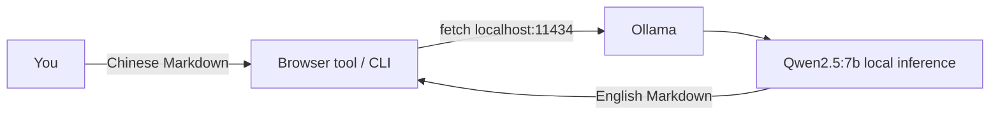

# Preface

This post reflects strong personal opinions. If you feel uncomfortable while reading, please close it immediately. This article is for personal learning records only. You are welcome to repost or share it under the license terms — please respect the copyright and keep the original link. Thank you for your understanding and cooperation. If you find this site helpful, consider subscribing via RSS. Thanks for your support!

---

## 1. What is local free translation

A large language model (LLM) does more than chat and code — translation is one of its strongest skills. But most people's first thought is ChatGPT or a translation API: online, account-gated, paid, and your content leaves the country.

Your own Mac can run an open-source model and translate Chinese Markdown into English **fully offline — free, no upload, works without internet**. This post walks you through the complete setup from zero.

The three pieces:

- **Ollama**: a local model runtime (runs the model; think Docker for containers)
- **Qwen2.5**: Alibaba's open-source model, strong in both Chinese and English; 7B runs smoothly on a Mac
- **Your browser**: calls the local model through a tool page; no command line needed for daily use



---

## 2. Prerequisites (read before installing)

### Hardware requirements

| Item | Minimum | Recommended | Notes |
| --- | --- | --- | --- |
| Mac chip | Apple Silicon (M1+) | Any M1/M2/M3/M4 | Intel works but is slow; Apple Silicon has MLX acceleration |
| RAM | 8 GB | **16 GB** | 8 GB can only run 3B; 16 GB handles 7B easily; 32 GB for 14B |
| Free disk space | 15 GB | 20 GB+ | Model weights ~5–10 GB, Jekyll + Ollama ~2 GB |
| macOS version | macOS 12 (Monterey) | macOS 13 / 14 / 15 | Ollama requires macOS 12+ |

> **How to check your RAM?** Apple menu → About This Mac → the "Memory" row. Same place for chip type.

### What you need to know beforehand

- Comfortable with the **Terminal** app (all commands are copy-paste, no compilation)
- Know the difference between "paste into terminal" and "press Enter"
- No English requirement — every command is copy-paste

---

## 3. Install from scratch (0 to 1)

> **One-shot script**: don't want to type step by step? The script at `tools/setup-local-llm-translator.sh` does all of this in one go. Run it:
>
> ```bash
> bash ~/Documents/sunyazhou/tools/setup-local-llm-translator.sh
> ```
>
> It **only runs on macOS** (checks OS up front and exits on anything else). It skips any step that's already done (Homebrew, Ollama, models). Check section "4. Verify your setup" after running to confirm readiness.

### Step 1: Install Homebrew (skip if already installed)

Homebrew is macOS's package manager — think App Store for the command line. Used to install Ollama and for future upgrades.

**Check if already installed**:

```bash
brew --version
```

If you see `Homebrew 4.x.x` you're done — skip to Step 2.

**Install if not**:

```bash
/bin/bash -c "$(curl -fsSL https://raw.githubusercontent.com/Homebrew/install/HEAD/install.sh)"
```

It will ask for your Mac login password twice (normal, no echo) and once for Enter to confirm the install path.

> **Apple Silicon (M1 and later) only**: after installing, Homebrew will prompt you to add its path to your shell config. Copy and run those two lines, otherwise `brew` won't be found:
>
> ```bash
> (echo; echo 'eval "$(/opt/homebrew/bin/brew shellenv)"') >> ~/.zprofile
> eval "$(/opt/homebrew/bin/brew shellenv)"
> ```
>
> **Intel Mac**: path is `/usr/local/bin/brew`; this step is not needed.

### Step 2: Install Ollama

Ollama is the "model runner". It is analogous to Docker — you install the runtime, but no images/models come with it.

```bash
brew install ollama
```

**Expected output** (excerpt, last few lines):

```
🍺  Congratulations! Ollama is installed.
   Run `ollama serve` to start the server.
```

> On macOS, Ollama **usually auto-starts the service** after installation, but not always. You can skip the "manually start serve" step and run `ollama list` first — if the service isn't up yet, come back and start it manually.

**Verify Ollama is installed**:

```bash
ollama --version
```

Output like `ollama version 0.x.x` is good.

### Step 3: Start the Ollama service

Translation tools and the CLI both connect to `localhost:11434`, so Ollama must keep running in the background.

**Option A: Foreground (debugging, see logs)**

```bash
ollama serve
```

The terminal will show `Ollama is running` and hang — **don't close this window**, it's the service process.

**Option B: Background (recommended; run once after install)**

```bash
nohup ollama serve > /tmp/ollama-serve.log 2>&1 &
echo "Ollama started in background, PID: $!"
```

Returns immediately to the prompt; closing the Terminal doesn't stop the service. Logs are at `/tmp/ollama-serve.log` — check with `cat /tmp/ollama-serve.log`.

**Option C: macOS LaunchAgent (auto-start on boot, recommended for daily use)**

Make Ollama start automatically every time you log in — never worry about `ollama serve` again:

```bash
# Create the plist file (run this once)
mkdir -p ~/Library/LaunchAgents
cat > ~/Library/LaunchAgents/com.ollama.ollama.plist << 'EOF'
<?xml version="1.0" encoding="UTF-8"?>
<!DOCTYPE plist PUBLIC "-//Apple//DTD PLIST 1.0//EN" "http://www.apple.com/DTDs/PropertyList-1.0.dtd">
<plist version="1.0">
<dict>
    <key>Label</key><string>com.ollama.ollama</string>
    <key>ProgramArguments</key><array>
        <string>/opt/homebrew/bin/ollama</string><string>serve</string>
    </array>
    <key>RunAtLoad</key><true/>
    <key>KeepAlive</key><true/>
</dict>
</plist>
EOF

# Load and start
launchctl load ~/Library/LaunchAgents/com.ollama.ollama.plist
echo "Set to auto-start. Verify with: launchctl list | grep ollama"
```

> **Intel Mac**: replace `/opt/homebrew/bin/ollama` with `/usr/local/bin/ollama`.

**Verify the service is up**:

```bash
curl -s http://localhost:11434/api/tags
```

Returns `{"models":[]}` or similar JSON — service is live. If you get `Connection refused`, go back to Option A/B/C to start it.

### Step 4: Pull the model to your machine

Ollama is installed, but **the model itself must be downloaded separately**. `ollama pull` is like `brew install` for model weight files, stored in `~/.ollama/models/`.

| Model | Size | Best for | RAM needed |
| --- | --- | --- | --- |
| `qwen2.5:3b` | ~2 GB | Fast first drafts, long posts, low-end machines | 8 GB+ |
| `qwen2.5:7b` | ~4.7 GB | **Default**: best quality/speed balance | 16 GB+ |
| `qwen2.5:14b` | ~9 GB | Highest quality, exact terminology required | 32 GB+ |

```bash
ollama pull qwen2.5:7b   # recommended: best quality
ollama pull qwen2.5:3b   # lightweight: faster, good for rough drafts
```

**Expected output** (first-time pull, shows progress):

```
pulling manifest
pulling 8ec2f7aad86b... 100%  ████████████████████  4.7 GB
pulling 4c9d85b5d93f... 100%  ████████████████████    137 B
verifying sha256 digest
writing manifest
success
```

Expect 4–15 minutes depending on network speed. **Works offline once downloaded** — weights live in `~/.ollama/models/`.

> If the pull fails mid-way (network issue), just re-run `ollama pull qwen2.5:7b`. Ollama supports resume — it continues from where it left off, not from scratch.

**Verify model is installed**:

```bash
ollama list
```

Expected output:

```
NAME                 SIZE      MODIFIED
qwen2.5:7b           4.7 GB    2 minutes ago
qwen2.5:3b           1.9 GB    5 minutes ago
```

---

## 4. Verify your setup is ready

Run these two commands to confirm everything is green:

```bash
# Check 1: Ollama service online
curl -s http://localhost:11434/api/tags >/dev/null && echo "✓ Service is up" || echo "✗ Service not running — run ollama serve"

# Check 2: model installed
ollama list | grep -q "qwen2.5" && echo "✓ Models ready" || echo "✗ No model found — run ollama pull qwen2.5:7b"
```

Both `✓` — you're done with setup. Time to translate.

---

## 5. How to use it

### Option A: Command line (30-second check)

Translate text without opening a browser:

```bash
echo "Translate this to natural English: Using Codable to parse JSON is very convenient" | ollama run qwen2.5:7b
```

**Expected output** (a few seconds):

```
Using default招待模式。Switch modes within a session using /set mixture.
Parsing JSON with Codable is very convenient.
```

> If you end up in interactive mode (`>>>` prompt), press `Ctrl+D` (or type `/bye`) to exit.

### Option B: Blog visual tool page (recommended for writing posts)

Translating a whole Markdown post involves front matter, code blocks, and URLs — doing it all in the CLI is tedious. The tool page at `/tools/md-translator/` automates this: paste Chinese Markdown, click once, code and links stay intact.

**Step by step**:

**Step 1: Start the blog locally** (required so the browser can reach your local Ollama)

```bash
cd ~/Documents/sunyazhou   # your blog directory
bundle install             # first time only; skip on subsequent runs
bundle exec jekyll s -l -o
```

> If you see `Could not find gem 'jekyll-polyglot'`, run `gem install jekyll-polyglot` or `bundle install`.
> If it hangs at `Bundle complete!`, open a new terminal tab and run `bundle exec jekyll s` there.

**Step 2: Open the tool page**

In your browser, navigate to: `http://127.0.0.1:4000/tools/md-translator/`

> ⚠️ **Must use `127.0.0.1` or `localhost`**. Do not open with `file://`. Avoid `0.0.0.0` — some machines route `0.0.0.0` traffic differently, and the browser won't reach `localhost:11434`.

**Step 3: Translate**

| Button | What it does |
| --- | --- |
| Translate | Translates the input area with the selected model |
| Load Sample | Fills in sample Chinese Markdown — click Translate to see the effect |
| Save Locally | Chrome / Edge: native macOS save dialog (recommended); Safari / Firefox: downloads to default folder |
| Copy | Copies output to clipboard |
| Clear | Clears both input and output |

**Step 4: Save to your blog**

After translation:

1. Click "Save Locally" → Chrome shows the macOS native save dialog
2. Navigate to your blog's `_posts/en/` folder
3. Confirm the filename (the tool auto-names it using the front matter date + English slug)
4. Click "Save"

> Example filename: `2026-08-27-local-llm-markdown-translator.md`

**The tool's protection mechanisms** (why feeding a raw file to the model would mangle code and URLs):

- **Front matter**: only `title` / `description` are translated; `date`, `tags`, `categories` etc. are kept verbatim
- **Fenced code blocks** ` ```swift `: locked with a placeholder, restored after — the model never touches code
- **Inline code** `` `Codable` ``: same protection
- **Links / image URLs**: only the visible text is translated; the address itself is untouched (even `title` attributes are preserved)
- **Glossary**: terms entered in "Locked glossary" (comma-separated, e.g. `KVO, KVC, Codable`) are locked and never translated — keeps terms consistent across the whole file
- **Chunked by blank lines**: long posts are split and translated concurrently; chunks with no Chinese are skipped; everything is losslessly stitched back together

**Minimal example** (verifying protection works):

Input (Chinese):

~~~markdown
# 用 Codable 解析 JSON

Swift 里 `Codable` 很好用，参考 [文档](https://developer.apple.com/codable)。

```swift
struct User: Codable { let name: String }
```
~~~

Output (English, code and URL intact):

~~~markdown
# Parse JSON with Codable

`Codable` is very useful in Swift. Check the [docs](https://developer.apple.com/codable).

```swift
struct User: Codable { let name: String }
```
~~~

> This tool is **for your own writing** — not for site visitors. The live blog is pure static Jekyll with no backend; a visitor's browser `localhost:11434` points at *their* computer, not yours. Only you can use it while running `jekyll serve` locally.

---

## 6. Troubleshooting

### Connection issues

| Symptom | Cause | Fix |
| --- | --- | --- |
| Translation says "can't reach Ollama" | `ollama serve` not running | Re-run: `ollama serve` (new terminal tab; don't close it) |
| `curl: (7) Failed to connect to localhost:11434` | Port not open / service down | `lsof -i :11434` to check; `ollama serve` to start |
| Can't connect after sleep / reboot | Service was killed | Re-run `ollama serve` (models stay, no re-pull needed) |
| Tool page blank | Not opened via jekyll local address | Use `http://127.0.0.1:4000/tools/md-translator/`, not `file://` |
| Browser shows `0.0.0.0:4000` | Jekyll bound to all interfaces | Kill Jekyll and re-run `bundle exec jekyll s -H 127.0.0.1 -l -o` |

### Model issues

| Symptom | Cause | Fix |
| --- | --- | --- |
| "Model not found" error | Model not installed | `ollama list` to check; `ollama pull qwen2.5:7b` |
| `ollama pull` stuck at 0% | Network cannot reach ollama.com | Switch to a better network / wait; supports resume — re-run to continue |
| Pull failed mid-way | Network glitch | Re-run `ollama pull qwen2.5:7b`; it resumes from where it left off |
| Pull too slow | Slow network | Try late night or a better network; qwen2.5:3b is only 2 GB and much faster |

### Memory issues

| Symptom | Cause | Fix |
| --- | --- | --- |
| Mac gets hot / fans loud during translation | Normal (model inference is CPU/GPU intensive) | Expected; Mac thermal design handles this fine |
| Translation hangs then times out | Not enough RAM for 7B | Switch to 3B: `ollama pull qwen2.5:3b`; change model box to `qwen2.5:3b` |
| `Killed: 9` or "Out of memory" | 8 GB Mac trying to run 14B | Downgrade to 3B or 7B |

### Quality issues

| Symptom | Cause | Fix |
| --- | --- | --- |
| Translation modified code block content | Placeholder protection bug | Report it; use "Load Sample" first to confirm code blocks stay intact |
| Translation changed a URL | Chinese params in URL got translated | Tool should handle this; report if you see it |
| Terminology inconsistent across file | Model didn't recognize a term | Add it to the "Locked glossary" field (comma-separated) and re-translate |
| Output is garbled | Model inference error | Switch to 3B or re-pull: `ollama rm qwen2.5:7b && ollama pull qwen2.5:7b` |

### Other

| Symptom | Cause | Fix |
| --- | --- | --- |
| `ollama: command not found` | Homebrew PATH not configured | Add to `~/.zshrc`: `eval "$(/opt/homebrew/bin/brew shellenv)"` then run it |
| `ollama serve` says port in use | Another process on port 11434 | `lsof -i :11434` to find PID; `kill -9 <PID>` to stop it |
| Jekyll says `Could not find gem` | Missing Ruby gem | `bundle install` |
| `bundle install` permission error | Blog directory ownership issue | `sudo chown -R $(whoami) ~/Documents/sunyazhou` |

---

## 7. Swap models

```bash
ollama pull qwen2.5:14b   # highest quality, but 16 GB RAM gets tight; 32 GB recommended
```

Change the model name in the tool page's "Model" input box to `qwen2.5:14b` (or any pulled model name) — **no restart of Ollama or Jekyll needed**, just refresh and try.

---

## 8. Long-term maintenance

### Update Ollama

```bash
brew upgrade ollama
```

### Update a model (re-pull latest version)

```bash
ollama pull qwen2.5:7b   # downloads and replaces with the newest version
```

### List installed models

```bash
ollama list
```

### Remove an unused model

```bash
ollama rm qwen2.5:3b   # frees ~2 GB
```

### Full uninstall (clean slate)

```bash
# Stop LaunchAgent (if configured)
launchctl unload ~/Library/LaunchAgents/com.ollama.ollama.plist
rm ~/Library/LaunchAgents/com.ollama.ollama.plist

# Uninstall Ollama
brew uninstall ollama

# Delete all model weights (~10 GB; asks for confirmation)
rm -rf ~/.ollama

# Remove Homebrew (optional)
/bin/bash -c "$(curl -fsSL https://raw.githubusercontent.com/Homebrew/install/HEAD/uninstall.sh)"
```

---

## 9. Command reference

| Scenario | Command |
| --- | --- |
| Install Homebrew | `/bin/bash -c "$(curl -fsSL https://raw.githubusercontent.com/Homebrew/install/HEAD/install.sh)"` |
| Install Ollama | `brew install ollama` |
| Start service (foreground) | `ollama serve` |
| Start service (background) | `nohup ollama serve > /tmp/ollama-serve.log 2>&1 &` |
| Check service is up | `curl -s http://localhost:11434/api/tags` |
| Pull 7B model | `ollama pull qwen2.5:7b` |
| Pull 3B model | `ollama pull qwen2.5:3b` |
| List installed models | `ollama list` |
| Delete a model | `ollama rm qwen2.5:7b` |
| Translate one line via CLI | `echo "sentence to translate" \| ollama run qwen2.5:7b` |
| Start blog | `cd ~/Documents/sunyazhou && bundle exec jekyll s -l -o` |
| Open tool page | `http://127.0.0.1:4000/tools/md-translator/` |
| Update Ollama | `brew upgrade ollama` |

---

## 10. Tips and wrap-up

- **Default to 7B**: best balance of quality and speed; 16 GB Mac handles it without breaking a sweat.
- **Keep a glossary**: put project-specific terms in the glossary field for consistent translation throughout the file.
- **Privacy first**: fully local — safe to paste unpublished content.
- **Free & offline forever**: install once, zero ongoing cost.
- **LaunchAgent saves the day**: configure it once and Ollama starts automatically on every login — never hunt for `ollama serve` again.

From installing Homebrew and Ollama, pulling Qwen2.5, to translating a full blog post via the tool page — not a cent spent, nothing leaving your machine. That's the 0 to 1 of local free translation.
